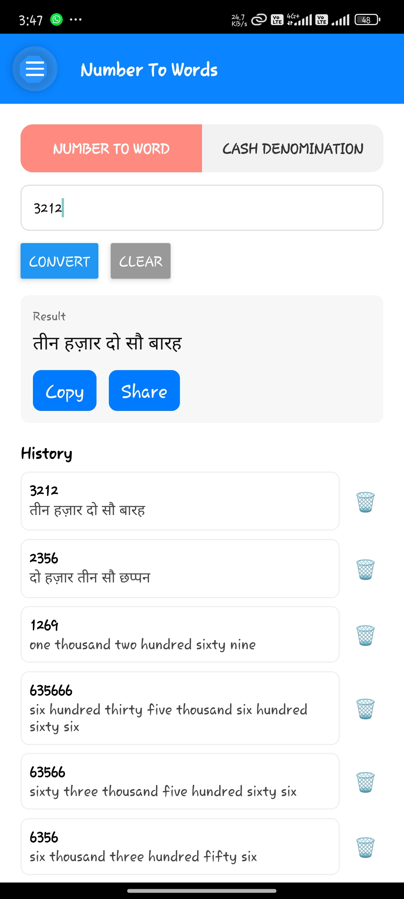
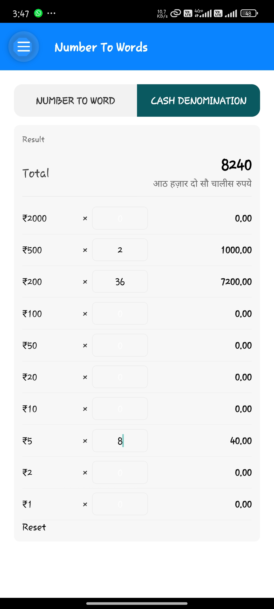
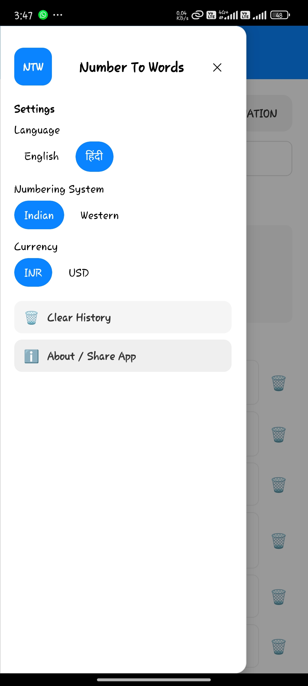
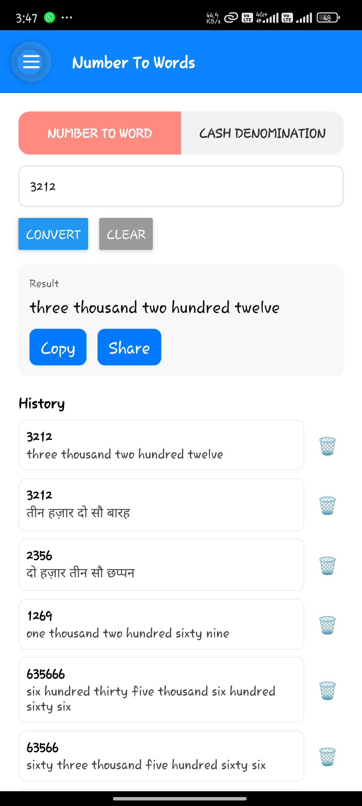

# NumToWords

Convert numbers into human-friendly text — English and Hindi, Western and Indian groupings.

## Quick highlights

- Converts integers and decimals to words
- Supports Western (thousand/million) and Indian (thousand/lakh/crore) systems
- English (`en`) and Hindi (`hi`) output
- Handles negatives and trims leading zeros

## Live screenshots

Below are recent screenshots of the app UI. Open them locally for full-resolution preview.

<p align="center">
  
  
  
  
</p>

## About this project

This repository contains a compact React Native application and a focused utility `numberToWords` (under `src/utils`). The utility is intentionally small and well-tested so it can be used independently in other projects or libraries.

### Why this matters (one-liner for recruiters)

This project demonstrates practical localization-aware algorithms, careful handling of numeric edge cases (fractions, negatives, leading zeros), and a clean React Native integration — useful for fintech, billing, or accessibility-focused products.

## Where the main logic lives

- `src/utils/numberToWords.ts` — pure function API: `numberToWords(input, { system: 'western'|'indian', lang: 'en'|'hi' })`

## Getting started (developer)

1. Install dependencies

```bash
npm install
```

2. Run Metro

```bash
npm start
```

3. Run on Android device/emulator

```bash
npm run android
```

## Build a shareable APK (Windows)

```powershell
Set-Location -LiteralPath 'android'
.\gradlew.bat assembleRelease
# APK: android\app\build\outputs\apk\release\app-release.apk
```

### Notes on signing

Currently the project uses the debug keystore for release builds (for quick sharing). For production use, generate a release keystore and update `android/gradle.properties` and `android/app/build.gradle` signing configuration as described in the project README.

## Testing

- Unit tests live in `__tests__/`. Run `npm test` to execute them.

## How to use `numberToWords` (examples)

```ts
import numberToWords from './src/utils/numberToWords';

numberToWords(12345); // "twelve thousand three hundred forty five"
numberToWords(12345, { system: 'indian' }); // "twelve thousand three hundred forty five" (example)
numberToWords('123.45', { lang: 'hi' }); // returns Hindi string with दशमलव
```

## Contribution

- PRs welcome: prefer small focused changes and tests for algorithm updates.

