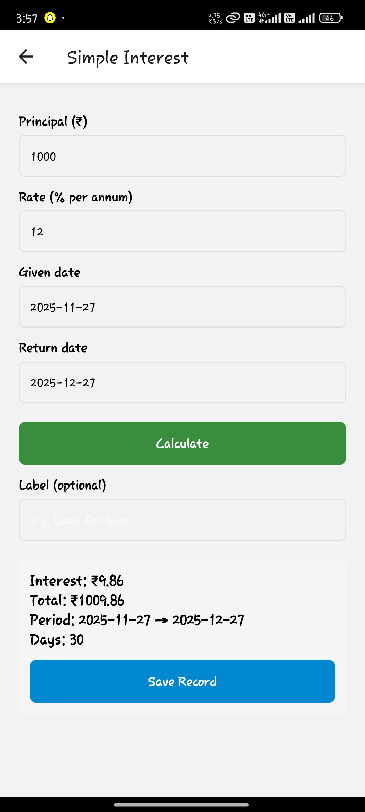
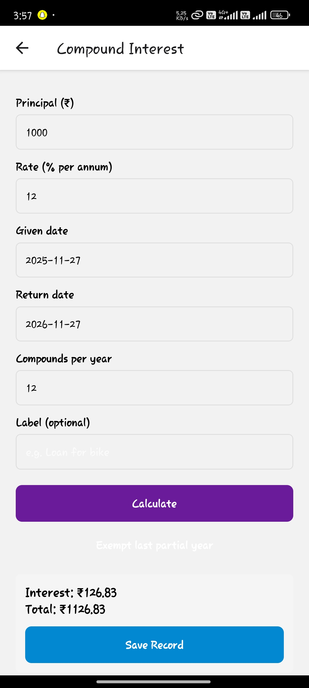

# VillIntCalci

A clean, focused React Native utility app for village interest calculations — modern UI, clear results, and offline-friendly logic.

## Highlights

- Purpose-built calculator (interest / payments / quick financial summaries)
- Clean mobile UI with localization-ready strings
- Lightweight, testable utility functions in `src/utils`
- Screenshots below show the app screens and example flows

## Screenshots

<p align="center">
  
  
  
  
  
  
</p>

## Quick overview 

VillIntCalci is a small, well-scoped mobile app that demonstrates practical mobile UX for financial tasks in low-connectivity environments. It showcases:

- Clear input validation and friendly error messages
- Deterministic calculation logic implemented in plain TypeScript functions
- Readable, maintainable components suitable for fast iteration

## Developer: run & build

1. Install dependencies

```bash
npm install
```

2. Start Metro

```bash
npm start
```

3. Run on Android

```bash
npm run android
```

4. Build release APK (Windows PowerShell)

```powershell
Set-Location -LiteralPath 'android'
.\gradlew.bat assembleRelease
# APK at android\app\build\outputs\apk\release\app-release.apk
```

## Where the logic lives

- `src/utils` — calculation helpers and pure functions (easy to test)
- `src/screens` — screen components and UI layout

## Testing

- Unit tests are available under `__tests__/` — run `npm test`.

## Contributing 

- PRs welcome: include tests for calculation changes and a short description of the business rules.

- Commit this README update for you.
